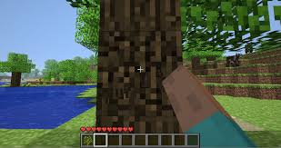
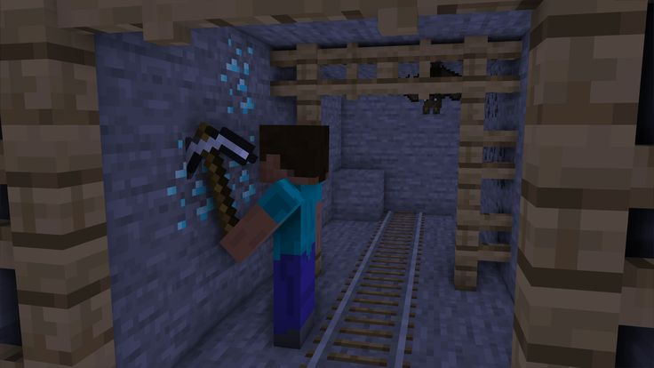
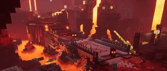
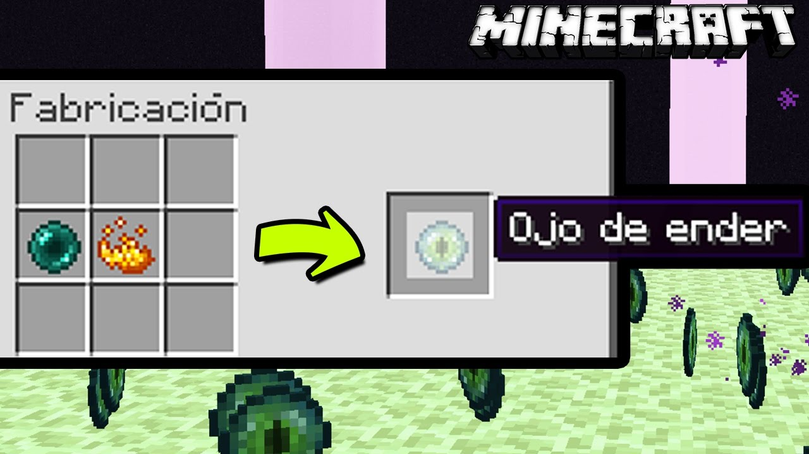
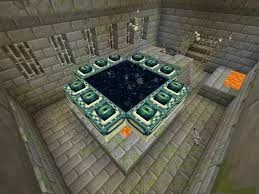
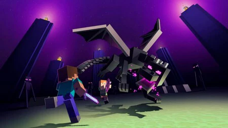
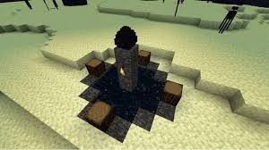

# Pasos a seguir para matar al dragon del end en Minecraft

### Inicio y Supervivencia Básica
Al comenzar un nuevo mundo, tu prioridad es recolectar madera y fabricar herramientas básicas. Talar árboles te dará la madera necesaria para crear un banco de trabajo y tus primeras herramientas de madera. A continuación, busca piedra para fabricar herramientas más duraderas (de piedra) y recolecta hierro en cuanto encuentres una cueva o una mina, ya que el hierro te permitirá hacer una espada, un escudo y armadura, que son vitales para tu protección. También necesitas recolectar alimentos cazando animales o plantando cultivos. Estos te ayudarán a regenerar salud. Finalmente, construye un refugio sencillo para pasar la noche y protegerte de los mobs hostiles, como zombis y esqueletos, que aparecen cuando oscurece.

### Preparación y Minería Avanzada
Una vez tengas lo esencial, es momento de empezar a buscar minerales avanzados, especialmente diamantes. Desciende a las profundidades del mundo, alrededor de los niveles Y 11-12, donde tienes la mejor oportunidad de encontrar diamantes. Necesitarás al menos tres diamantes para fabricar un pico de diamante, lo cual es indispensable para minar bloques de obsidiana. Este material será necesario para construir un portal al Nether, tu próximo destino. Mientras tanto, recolecta también otros recursos importantes como más hierro y carbón para mantener tu equipo en buen estado y para que puedas fabricar suficiente armadura y herramientas.

### Preparación para el Nether
Con el pico de diamante en mano, encuentra una fuente de lava y combínala con agua para crear obsidiana. Extrae al menos 10 bloques de obsidiana, los cuales necesitarás para construir un portal al Nether. Antes de adentrarte, es muy útil tener una mesa de encantamientos, que puedes crear usando dos diamantes adicionales, un libro y cuatro bloques de obsidiana. En la mesa de encantamientos, mejora tus armas y armadura con encantamientos que aumenten tu resistencia y capacidad de ataque. En particular, los encantamientos como Protección y Agudeza para tus armas son muy útiles. Lleva un buen suministro de alimentos, un arco con flechas, y asegúrate de tener armadura de hierro o diamante antes de cruzar al Nether.

### Aventura en el Nether
Al entrar al Nether, tu primer objetivo es encontrar una fortaleza, ya que ahí podrás obtener varas de Blaze. Estos ítems son necesarios para progresar en el juego, ya que con ellos podrás fabricar polvo de Blaze. Este polvo se combinará luego con perlas de Ender para crear ojos de Ender, esenciales para encontrar el portal al End. Los Blazes se encuentran en estas fortalezas, y debes enfrentarlos con cuidado, ya que lanzan bolas de fuego que pueden hacer bastante daño. Además, si necesitas más perlas de Ender, puedes comerciar con Piglins en el Nether; para ello, lleva lingotes de oro y ofréceselos a cambio de estas perlas.

### Reúne Ojos de Ender
Para progresar, necesitas recolectar perlas de Ender. Puedes obtenerlas en el Overworld matando Endermans, que suelen aparecer de noche o en biomas específicos, como el desierto o las tierras de guerra. Otra opción es comerciar con los Piglins en el Nether para obtener estas perlas. Una vez tengas las perlas de Ender, vuelve a tu mesa de trabajo y combínalas con polvo de Blaze para crear ojos de Ender. Estos ojos serán clave para localizar la fortaleza en el Overworld que contiene el portal al End.

### Encuentra y Activa el Portal al End
Con varios ojos de Ender en tu inventario, lánzalos uno a uno en el Overworld para que te guíen hacia una fortaleza subterránea (Stronghold). Los ojos de Ender volarán en la dirección de la fortaleza, y debes seguirlos, recuperando tantos como puedas para evitar quedarte sin ellos antes de tiempo. Una vez que llegues a la fortaleza, explora hasta encontrar la sala del portal, que tiene un marco de portal al End y un generador de Silverfish. Coloca los ojos de Ender en los bloques del marco del portal para activarlo. Esto abrirá el portal al End, donde se encuentra el Dragón.

### Preparativos Finales
Antes de entrar al portal, asegúrate de estar bien equipado para el combate. Lleva armadura completa, preferiblemente de diamante y encantada con Protección u otros encantamientos defensivos. Un arco es esencial para destruir los cristales de curación del Dragón, así que lleva suficientes flechas y, si puedes, un arco encantado con Poder. También lleva contigo comida suficiente para regenerar salud, bloques para construir en caso de que necesites moverte por las torres, y una espada de diamante encantada para atacar al Dragón cuando descienda.

### Pelea contra el Dragón del End
Una vez en el End, tu primer objetivo es destruir los cristales de curación que se encuentran en las torres de obsidiana, ya que estos cristales curan al Dragón. Usa el arco para romper los cristales desde la distancia, y sube a las torres si es necesario, pero ten cuidado con las explosiones de los cristales. Con los cristales destruidos, ataca al Dragón del End, disparándole flechas cuando esté volando y usando la espada cuando descienda. Evita mirar a los Enderman, ya que te atacarán si haces contacto visual; si es necesario, puedes usar una calabaza en la cabeza para evitar que se vuelvan hostiles.

### Reclama tu Victoria
Cuando derrotes al Dragón del End, recibes una gran cantidad de experiencia y se abre un portal de regreso al Overworld. Además, el Dragón dejará un huevo como trofeo. Si deseas recolectarlo, golpéalo para que se mueva a una superficie accesible y luego coloca una antorcha debajo del bloque para que caiga y puedas recogerlo. Esto marca el final de tu aventura, y puedes regresar al Overworld como vencedor del Dragón del End.

Hecho por Daniel Ponce.