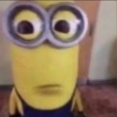

# Lore de la Saga Dark Souls

La saga *Dark Souls* cuenta con un lore profundo y complejo, lleno de simbolismos y una narrativa fragmentada. Creada por FromSoftware y dirigida por Hidetaka Miyazaki, la historia de *Dark Souls* requiere que los jugadores exploren y conecten detalles para comprender sus misterios. Aquí tienes un resumen de la historia y de los temas principales que recorren los tres juegos de la saga.

## 1. La Primera Llama y el Ciclo del Fuego

La historia de *Dark Souls* comienza en una era de oscuridad y dragones eternos. En esta era, no existía el fuego ni el tiempo, y todo era estático hasta que surgió la **Primera Llama**, una fuente de poder que trajo la **disparidad**: calor y frío, luz y oscuridad, vida y muerte. Esta llama transformó el mundo y despertó a varias entidades que se convirtieron en los grandes gobernantes de esta era.

### Las Almas de los Señores

Entre estas entidades, algunos encontraron **Almas de los Señores** en la llama:

- **Gwyn**, quien halló el Alma de la Luz y se convirtió en el Señor de la Luz Solar.
- **Nito**, quien obtuvo el poder de la muerte y desató la descomposición en el mundo.
- **La Bruja de Izalith** y sus hijas, que manipularon el fuego.
- **El Pigmeo Furtivo**, quien encontró el Alma Oscura y fue el progenitor de la humanidad.

Con el poder de estas almas, los Señores se rebelaron contra los dragones. Gwyn, con sus caballeros, usó rayos para romper las escamas de los dragones, mientras que Nito desató enfermedades y la Bruja de Izalith usó su magia. Así, los dragones fueron derrotados y comenzó la **Era del Fuego**, con Gwyn y sus aliados reinando sobre un mundo de luz y prosperidad.

### La Decadencia de la Llama

Con el tiempo, la llama comenzó a apagarse, y con ella el poder de los Señores. Gwyn, temeroso del fin de su reinado, tomó una decisión desesperada: **sacrificarse para avivar la llama**, generando un ciclo en el que la llama se encendería y apagaría repetidamente, trayendo una era de luz y otra de oscuridad de forma continua.

## 2. La Maldición de los No Muertos y el Ciclo de la Llama

El sacrificio de Gwyn trajo consigo la **Maldición de los No Muertos**, que condena a ciertos humanos a morir y revivir una y otra vez, perdiendo poco a poco su humanidad hasta convertirse en **Huecos** (seres sin mente). Los No Muertos son atraídos a la llama en una búsqueda para "prolongar" el ciclo y mantener viva la luz.

En *Dark Souls I*, el jugador es un No Muerto elegido que escapa del **Refugio de los No Muertos** y sigue una profecía que le lleva a **Lordran**, el reino de Gwyn. Su objetivo es vincular la llama o dejar que esta se apague, poniendo fin al ciclo de luz y oscuridad.

El jugador enfrenta a los antiguos Señores y seres poderosos como los Cuatro Reyes, Nito, la Bruja de Izalith y, finalmente, a Gwyn, quien se ha convertido en una versión hueca de sí mismo, obsesionado con preservar la llama.

## 3. La Tragedia de los Reinos y los Ecos del Ciclo (Dark Souls II)

En *Dark Souls II*, el jugador es otro No Muerto, atraído por la promesa de romper la maldición. Este juego tiene lugar en **Drangleic**, un reino en ruinas debido a las guerras, la ambición de sus gobernantes y el ciclo de la llama.

El rey de Drangleic, **Vendrick**, buscó proteger a su gente de la maldición y se obsesionó con el poder de las almas. Eventualmente, fue traicionado por su reina, **Nashandra**, quien en realidad era un fragmento del Pigmeo Furtivo y quería apoderarse de la Primera Llama para desatar una Era de Oscuridad.

En este juego, el jugador puede optar por sentarse en el trono y seguir el ciclo, o buscar caminos alternativos para evitar la repetición de la tragedia.

## 4. La Desesperación y el Final del Ciclo (Dark Souls III)

*Dark Souls III* es la conclusión de la saga, situada en el **Reino de Lothric**, donde el ciclo está en su punto crítico y la llama se apaga más rápido que nunca. Los antiguos Señores han sido sucedidos por otros llamados **Señores de la Ceniza**, quienes también intentaron avivar la llama. Sin embargo, el ciclo está tan desgastado que la llama ya no puede mantenerse encendida completamente.

El jugador, conocido como **No Muerto Cenizo** o "Ashen One", es revivido para reunir a los Señores de la Ceniza y decidir el destino final de la llama. Al final, el jugador puede elegir entre varias opciones:

- **Vincular la llama**: Mantener el ciclo encendido un poco más, aunque cada vez será menos efectivo.
- **Dejar que la llama se apague**: Permitirá la llegada de la Era Oscura.
- **Usurpar la llama** (en un final secreto), absorbiendo su poder y trayendo una era en la que los humanos serán los dueños de su destino.

## Temas Centrales

1. **El Ciclo Eterno**: La historia de *Dark Souls* refleja un ciclo de destrucción y renacimiento que simboliza la lucha humana contra la muerte y el cambio. Este ciclo es una metáfora de la futilidad de resistir el cambio y la inevitabilidad del fin.

2. **La Luz y la Oscuridad**: El fuego representa la luz, la vida y el poder, mientras que la oscuridad simboliza la humanidad, la muerte y la mortalidad. La llama es tanto salvación como tormento, atrapando a los personajes en una lucha sin fin.

3. **La Ambición y la Decadencia**: Los reinos de *Dark Souls* están llenos de tragedias causadas por la ambición de sus gobernantes. La búsqueda de poder y la resistencia al cambio llevan a la destrucción.

4. **La Tragedia de la Humanidad**: La humanidad en *Dark Souls* está representada por la oscuridad, una fuerza temida por los dioses, pero que en realidad es la verdadera naturaleza de los humanos. La saga explora la lucha de la humanidad por escapar de la muerte y la desesperación, aunque en el fondo siempre es empujada hacia ella.

## Conclusión

El lore de *Dark Souls* es profundo y trágico, lleno de personajes que buscan un propósito en un mundo donde la esperanza es una ilusión. Miyazaki diseñó esta historia para que los jugadores se sumergieran en un universo decadente que cuestiona la moralidad de prolongar la existencia a cualquier costo y la futilidad de luchar contra el cambio y la muerte. Los jugadores, al igual que los personajes de la historia, deben decidir si aceptan el final o si están dispuestos a sufrir una vez más para prolongar un ciclo de luz que inevitablemente se desvanecerá.
